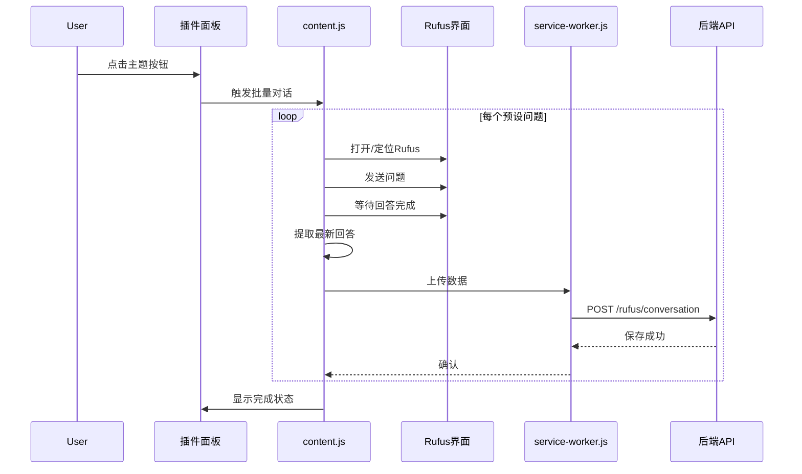

# Rufus 自动化对话采集系统

## 核心需求

- 6 个分析主题按钮，每个主题包含 2-3 个预设问题
- 点击按钮后自动：打开 Rufus -> 逐个发送问题 -> 等待回答 -> 采集数据
- 每个问答完成后立即保存到数据库，标记问题类型

## 技术架构



## 一、预设问题库设计

在 [extension/src/content/content.js](extension/src/content/content.js) 中定义问题配置：

```javascript
const RUFUS_QUESTION_TOPICS = {
  wish_it_had: {
    name: '功能改进建议',
    icon: '💡',
    questions: [
      "In the current reviews, what features do buyers most commonly mention using the 'I wish it had...' phrase? Please summarize the top 3-5 wishes.",
      "What improvements do customers suggest for this product based on their reviews?"
    ]
  },
  quality_issues: {
    name: '质量问题',
    icon: '🔧',
    questions: [
      "What are the most common quality issues or defects mentioned in the reviews?",
      "How durable is this product according to customer feedback? What breaks or wears out?"
    ]
  },
  price_value: {
    name: '性价比',
    icon: '💰',
    questions: [
      "Do customers think this product is worth the price? Summarize the value-for-money feedback.",
      "What do reviews say about the price compared to similar products?"
    ]
  },
  comparison: {
    name: '竞品对比',
    icon: '⚖️',
    questions: [
      "How do customers compare this product to competitors or alternatives they've tried?",
      "What brands or products do reviewers mention as better or worse alternatives?"
    ]
  },
  use_scenarios: {
    name: '使用场景',
    icon: '👥',
    questions: [
      "What are the most common use cases and scenarios mentioned in reviews?",
      "Who is this product best suited for according to customer reviews? Any age groups or skill levels?"
    ]
  },
  positive_highlights: {
    name: '好评亮点',
    icon: '⭐',
    questions: [
      "What features or aspects do customers praise the most in their positive reviews?",
      "What makes customers recommend this product to others?"
    ]
  }
};
```

## 二、精确的 Rufus 回答提取

**核心问题**：当前提取逻辑不准确，会抓取到错误内容。

**解决方案**：基于"对话消息计数"的增量提取

```javascript
// 获取当前对话中的所有消息数量
function getRufusMessageCount() {
  const messageSelectors = [
    '[data-testid*="message"]',
    '[class*="chat-message"]',
    '[class*="ChatMessage"]',
    // Rufus 特定的消息容器
  ];
  // 返回消息数量
}

// 等待新消息出现并提取
async function waitAndExtractNewMessage(previousCount, timeout) {
  // 轮询检查消息数量是否增加
  // 当数量增加且内容稳定时，提取最后一条消息
}
```

## 三、批量对话流程

```javascript
async function runTopicQuestions(topicKey) {
  const topic = RUFUS_QUESTION_TOPICS[topicKey];
  const results = [];
  
  for (let i = 0; i < topic.questions.length; i++) {
    const question = topic.questions[i];
    updateStatus(`正在提问 ${i+1}/${topic.questions.length}...`);
    
    // 1. 记录当前消息数量
    const beforeCount = getRufusMessageCount();
    
    // 2. 发送问题
    await sendRufusQuestion(question);
    
    // 3. 等待并提取新回答
    const answer = await waitAndExtractNewMessage(beforeCount, 60000);
    
    // 4. 立即上传
    await uploadConversation({
      asin, marketplace, question, answer,
      question_type: topicKey,
      question_index: i
    });
    
    results.push({ question, answer, success: true });
    
    // 5. 等待间隔，避免太快
    await sleep(2000);
  }
  
  return results;
}
```

## 四、UI 改造

将现有的单按钮改为主题按钮组：

```html
<div class="voc-rufus-section">
  <div class="voc-rufus-header">Rufus AI 洞察</div>
  <div class="voc-rufus-topics">
    <button data-topic="wish_it_had">💡 功能改进</button>
    <button data-topic="quality_issues">🔧 质量问题</button>
    <button data-topic="price_value">💰 性价比</button>
    <button data-topic="comparison">⚖️ 竞品对比</button>
    <button data-topic="use_scenarios">👥 使用场景</button>
    <button data-topic="positive_highlights">⭐ 好评亮点</button>
  </div>
  <div class="voc-rufus-progress"><!-- 进度显示 --></div>
  <div class="voc-rufus-results"><!-- 结果展示 --></div>
</div>
```

## 五、后端数据结构优化

在 [backend/app/api/schemas.py](backend/app/api/schemas.py) 中添加 `question_index` 字段：

```python
class RufusConversationRequest(BaseModel):
    asin: str
    marketplace: str
    question: str
    answer: str
    question_type: str  # 主题类型：wish_it_had, quality_issues 等
    question_index: int = 0  # 该主题下的第几个问题
    conversation_id: Optional[str] = None
```

数据库迁移添加字段：

```sql
ALTER TABLE rufus_conversations 
ADD COLUMN IF NOT EXISTS question_index INTEGER DEFAULT 0;
```

## 六、关键技术挑战与解决

| 挑战 | 解决方案 |

|------|----------|

| DOM 选择器不稳定 | 提供多套选择器 + 可视元素尺寸验证 |

| 无法区分问答对 | 基于消息数量增量检测 |

| 回答内容不完整 | 等待内容稳定（长度不再变化） |

| 提取到 JS 代码 | 内容清洗 + 可见性验证 |

## 七、文件修改清单

- [extension/src/content/content.js](extension/src/content/content.js)
  - 添加问题配置 `RUFUS_QUESTION_TOPICS`
  - 重写 `extractRufusResponse()` 为增量提取
  - 新增 `runTopicQuestions()` 批量处理函数
  - 改造 UI 为多按钮布局

- [extension/src/content/overlay.css](extension/src/content/overlay.css)
  - 添加主题按钮组样式
  - 添加进度条样式

- [backend/app/api/schemas.py](backend/app/api/schemas.py)
  - 添加 `question_index` 字段

- [backend/app/models/rufus_conversation.py](backend/app/models/rufus_conversation.py)
  - 添加 `question_index` 字段

- [db/migrate_rufus.sql](db/migrate_rufus.sql)
  - 添加 `question_index` 列的迁移语句