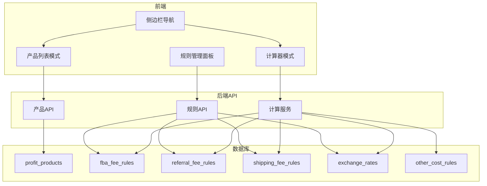

# 毛利计算功能模块开发计划

## 功能架构



## 一、数据库设计

创建迁移文件 `db/migrate_profit_calculator.sql`：

### 1. 产品毛利表 `profit_products`

存储用户录入的产品信息：

- 产品名称、尺寸（长/宽/高/重量）
- 预期售价（USD）、总成本（CNY）
- 关联用户ID

### 2. 规则配置表

| 表名 | 用途 | 核心字段 |

|------|------|----------|

| `fba_fee_rules` | FBA配送费率 | size_tier, weight_min, weight_max, fee |

| `referral_fee_rules` | 品类佣金比例 | category, fee_percentage, min_fee |

| `shipping_fee_rules` | 头程运费 | shipping_type(普海/美森/空运), rate_per_unit, unit_type(立方/公斤) |

| `exchange_rates` | 汇率配置 | currency_pair, rate, updated_at |

| `other_cost_rules` | 其他费用 | rule_name, rule_type, value |

## 二、后端实现

### 1. 新增文件

- [backend/app/models/profit_calculator.py](backend/app/models/profit_calculator.py) - 数据库模型
- [backend/app/api/profit_calculator.py](backend/app/api/profit_calculator.py) - API路由
- [backend/app/services/profit_calculator_service.py](backend/app/services/profit_calculator_service.py) - 计算服务

### 2. 核心计算逻辑

根据图片中的公式，毛利计算涉及：

```python
# 体积重计算
volume_weight = (length * width * height) / 139  # 盎司

# FBA费用 - 根据尺寸分段查表
fba_fee = get_fba_fee(size_tier, actual_weight)

# 头程运费
volume_cbm = length * width * height / 1000000
sea_shipping = volume_cbm * sea_rate  # 普海
meisei_shipping = volume_cbm * meisei_rate  # 美森
air_shipping = weight_kg * air_rate  # 空运

# 佣金
referral_fee = selling_price * referral_percentage

# 毛利计算
gross_profit = selling_price - fba_fee - shipping_cny/exchange_rate - referral_fee - tariff - cost_cny/exchange_rate
profit_margin = gross_profit / selling_price
```

### 3. API端点

- `POST /api/v1/profit/calculate` - 即时计算（不保存）
- `GET/POST/PUT/DELETE /api/v1/profit/products` - 产品CRUD
- `GET/POST/PUT/DELETE /api/v1/profit/rules/{rule_type}` - 规则管理

## 三、前端实现

### 1. 导航添加

修改 [frontend/src/app/components/home/HomeSidebar.tsx](frontend/src/app/components/home/HomeSidebar.tsx)：

- 添加导航项 `{ id: 'profit-calculator', label: '毛利计算', icon: Calculator }`

修改 [frontend/src/app/types/homepage.types.ts](frontend/src/app/types/homepage.types.ts)：

- AppSection 类型添加 `'profit-calculator'`

修改 [frontend/src/app/components/home/HomePage.tsx](frontend/src/app/components/home/HomePage.tsx)：

- 添加 `ProfitCalculatorSection` 路由渲染

### 2. 新增组件

```
frontend/src/app/components/home/sections/
└── ProfitCalculatorSection.tsx   # 主容器

frontend/src/app/components/profit-calculator/
├── ProfitCalculator.tsx          # 单品计算器（左侧面板）
├── ProductTable.tsx              # 产品列表表格（右侧面板）
├── ProductFormModal.tsx          # 产品录入/编辑弹窗
├── RulesPanel.tsx                # 规则管理面板（折叠/展开）
├── FBAFeeRulesEditor.tsx         # FBA费率编辑器
├── ReferralFeeRulesEditor.tsx    # 佣金规则编辑器
├── ShippingRulesEditor.tsx       # 运费规则编辑器
└── ExchangeRateEditor.tsx        # 汇率编辑器
```

### 3. 页面布局

采用双栏布局：

- 左侧：快速计算器（实时计算，不保存）
- 右侧：产品列表表格（已保存产品，显示各项利润率）
- 顶部/底部：可折叠的规则管理面板

## 四、核心字段说明（基于图片）

产品表需要存储的字段：

- `name` - 品名
- `length_cm`, `width_cm`, `height_cm` - 尺寸（厘米）
- `weight_g` - 重量（克）
- `selling_price_usd` - 预期售价（美元）
- `total_cost_cny` - 总成本（人民币）

计算字段（实时计算，不存储）：

- FBA体积重、尺寸分段、FBA Fee
- 普海/美森/空运运费
- 亚马逊佣金、配置金、关税
- 各渠道净利润和利润率

## 五、初始化规则数据

在迁移脚本中插入亚马逊官方FBA费率的默认值（2024/2025年标准费率），用户可后续修改。