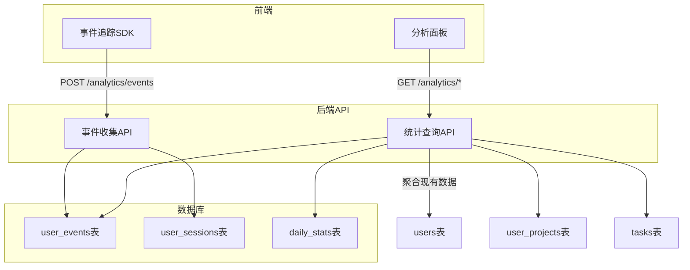

# 用户行为分析面板实现计划

## 一、架构设计



## 二、数据库设计

新增 3 张表用于行为追踪：

**1. user_events (用户事件表)** - 记录所有用户操作事件

| 字段 | 类型 | 说明 |

|------|------|------|

| id | UUID | 主键 |

| user_id | UUID | 用户ID (可为空,支持匿名事件) |

| event_type | VARCHAR(50) | 事件类型: page_view/click/feature_use |

| event_name | VARCHAR(100) | 事件名称: home_visit/add_product/start_analysis |

| event_data | JSONB | 附加数据 |

| page_path | VARCHAR(200) | 页面路径 |

| session_id | VARCHAR(100) | 会话ID |

| created_at | TIMESTAMP | 事件时间 |

**2. user_sessions (用户会话表)** - 追踪用户访问会话

| 字段 | 类型 | 说明 |

|------|------|------|

| id | UUID | 主键 |

| user_id | UUID | 用户ID |

| session_id | VARCHAR(100) | 会话标识 |

| started_at | TIMESTAMP | 开始时间 |

| ended_at | TIMESTAMP | 结束时间 |

| duration_seconds | INTEGER | 会话时长 |

| page_views | INTEGER | 页面浏览数 |

| user_agent | VARCHAR(500) | 浏览器信息 |

**3. daily_stats (每日统计表)** - 聚合统计数据

| 字段 | 类型 | 说明 |

|------|------|------|

| id | UUID | 主键 |

| stat_date | DATE | 统计日期 (唯一) |

| total_users | INTEGER | 累计用户数 |

| new_users | INTEGER | 新增用户数 |

| active_users | INTEGER | 活跃用户数 |

| products_added | INTEGER | 新增产品数 |

| tasks_completed | INTEGER | 完成任务数 |

| reports_generated | INTEGER | 生成报告数 |

## 三、后端 API 设计

在 [backend/app/api/analytics.py](backend/app/api/analytics.py) 新建 API 路由：

**事件收集接口 (前端SDK调用):**

- `POST /api/v1/analytics/events` - 批量上报事件
- `POST /api/v1/analytics/session/heartbeat` - 会话心跳

**统计查询接口 (仅管理员):**

- `GET /api/v1/analytics/dashboard` - 获取仪表盘概览数据
- `GET /api/v1/analytics/users/growth` - 用户增长趋势 (按天)
- `GET /api/v1/analytics/users/active` - 活跃用户统计
- `GET /api/v1/analytics/features` - 功能使用统计
- `GET /api/v1/analytics/retention` - 用户留存率
- `GET /api/v1/analytics/events/recent` - 最近事件流

## 四、前端实现

**1. 事件追踪 SDK** - 新增 `frontend/src/utils/analytics.ts`

自动追踪:

- 页面访问 (路由变化)
- 会话开始/结束
- 用户登录/登出

手动追踪 (业务代码调用):

- 功能点击: `track('add_product', { asin: 'xxx' })`
- 关键操作: `track('start_analysis', { type: 'comparison' })`

**2. 分析面板组件** - 新增 `frontend/src/app/components/analytics/`

```
analytics/
├── AnalyticsDashboard.tsx    # 主面板
├── StatsOverview.tsx         # 核心指标卡片
├── UserGrowthChart.tsx       # 用户增长趋势图
├── FeatureUsageChart.tsx     # 功能使用分布图
├── ActiveUsersChart.tsx      # 活跃用户时段图
├── RetentionChart.tsx        # 用户留存分析
└── RecentEventsTable.tsx     # 最近事件流
```

**3. 路由配置** - 修改 [frontend/src/app/App.tsx](frontend/src/app/App.tsx)

新增管理员专属路由:

```tsx
<Route path="/analytics" element={
  <AdminRoute><AnalyticsDashboard /></AdminRoute>
} />
```

**4. 权限组件** - 新增 `AdminRoute.tsx`

基于现有 `ProtectedRoute` 扩展，增加 `is_admin` 检查。

## 五、面板功能模块

**核心指标卡片:**

- 总用户数 + 今日新增 (环比)
- 活跃用户数 (7日/30日)
- 总产品数 + 今日新增
- 任务总数 + 完成率
- 报告生成总数

**图表区域:**

- 用户增长趋势 (折线图, 支持 7/30/90 天切换)
- 功能使用分布 (柱状图: 添加产品/翻译/分析/报告)
- 每日活跃用户 (面积图)
- 用户留存分析 (留存表格)

**事件流:**

- 最近 50 条用户操作事件实时展示

## 六、需要修改的现有文件

- [backend/app/main.py](backend/app/main.py) - 注册新的 analytics router
- [backend/app/models/__init__.py](backend/app/models/__init__.py) - 导出新模型
- [frontend/src/app/App.tsx](frontend/src/app/App.tsx) - 添加 /analytics 路由
- [frontend/src/app/contexts/AuthContext.tsx](frontend/src/app/contexts/AuthContext.tsx) - 已有 is_admin 字段,无需修改

## 七、需要新增的文件

**后端:**

- `backend/app/models/analytics.py` - 分析相关模型
- `backend/app/api/analytics.py` - 分析 API 路由
- `backend/app/services/analytics_service.py` - 分析服务层
- `db/migrate_analytics.sql` - 数据库迁移脚本

**前端:**

- `frontend/src/utils/analytics.ts` - 事件追踪 SDK
- `frontend/src/app/components/AdminRoute.tsx` - 管理员路由守卫
- `frontend/src/app/components/analytics/` - 分析面板组件目录