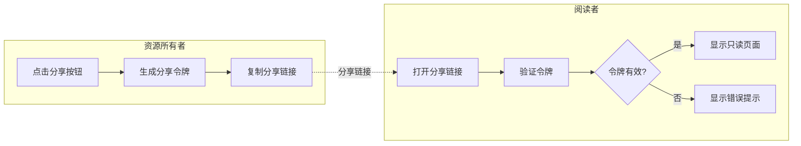

# 页面分享链接功能实现计划

## 需求分析

需要支持分享的 5 种页面类型：

- **评论详情页** (`/reader/:asin`) - 显示产品评论列表和统计信息
- **报告详情页** (`/report/:asin/:reportId?`) - 显示 AI 生成的产品分析报告
- **竞品对比分析** (`/analysis/:projectId`) - comparison 类型分析项目
- **市场品类分析** (`/analysis/:projectId`) - market_insight 类型分析项目
- **Rufus 调研详情页** (`/rufus/session/:sessionId`) - Rufus AI 对话记录

阅读者要求：**无需登录**，**只读权限**

---

## 技术方案：分享令牌（Share Token）

### 核心设计



---

## 一、后端实现

### 1.1 新建分享链接数据模型

创建 [backend/app/models/share_link.py](backend/app/models/share_link.py)：

```python
class ShareResourceType(str, enum.Enum):
    REVIEW_READER = "review_reader"      # 评论详情页
    REPORT = "report"                     # 报告详情页
    ANALYSIS_PROJECT = "analysis_project" # 对比分析/市场洞察
    RUFUS_SESSION = "rufus_session"       # Rufus 会话
```

核心字段：

- `id`: UUID 主键
- `token`: 短字符串分享令牌（使用 nanoid，12位）
- `resource_type`: 资源类型枚举
- `resource_id`: 资源 UUID（报告/分析项目/会话 ID）
- `asin`: 可选字段（用于评论详情/报告）
- `user_id`: 创建者用户 ID
- `expires_at`: 过期时间（可选，支持永久链接）
- `view_count`: 访问次数统计
- `is_active`: 是否有效
- `created_at`: 创建时间

### 1.2 新建数据库迁移

创建 [db/migrate_share_links.sql](db/migrate_share_links.sql)

### 1.3 新建分享服务

创建 [backend/app/services/share_service.py](backend/app/services/share_service.py)：

核心方法：

- `create_share_link()` - 创建分享链接
- `get_share_link_by_token()` - 通过令牌获取分享信息
- `validate_and_get_resource()` - 验证令牌并返回资源数据
- `revoke_share_link()` - 撤销分享链接
- `get_user_share_links()` - 获取用户创建的所有分享链接

### 1.4 新建分享 API

创建 [backend/app/api/share.py](backend/app/api/share.py)：

**需要认证的接口（资源所有者）：**

- `POST /api/v1/share` - 创建分享链接
- `GET /api/v1/share/my` - 获取我的分享链接列表
- `DELETE /api/v1/share/{token}` - 撤销分享链接

**公开接口（阅读者访问）：**

- `GET /api/v1/share/{token}` - 获取分享资源元信息
- `GET /api/v1/share/{token}/data` - 获取分享资源的完整数据

### 1.5 注册路由

修改 [backend/app/main.py](backend/app/main.py)，添加分享路由。

---

## 二、前端实现

### 2.1 新建公开访问路由

修改 [frontend/src/app/App.tsx](frontend/src/app/App.tsx)，添加分享页面路由：

```tsx
// 公开页面 - 无需认证
<Route path="/share/:token" element={<ShareViewPage />} />
```

### 2.2 新建分享查看页面

创建 [frontend/src/app/components/share/ShareViewPage.tsx](frontend/src/app/components/share/ShareViewPage.tsx)：

- 根据资源类型渲染对应的只读视图
- 复用现有组件，但禁用所有编辑操作
- 显示"分享链接"水印或提示
- 处理令牌无效/过期的情况

### 2.3 创建分享按钮组件

创建 [frontend/src/app/components/share/ShareButton.tsx](frontend/src/app/components/share/ShareButton.tsx)：

- 点击弹出分享设置对话框
- 支持设置过期时间（可选）
- 生成链接后一键复制
- 显示分享链接的访问统计

### 2.4 为各页面添加分享按钮

需要修改的页面组件：

- [frontend/src/app/components/ReviewReader.tsx](frontend/src/app/components/ReviewReader.tsx)
- [frontend/src/app/components/ReportPage.tsx](frontend/src/app/components/ReportPage.tsx)（已有分享按钮，需对接）
- [frontend/src/app/components/AnalysisResultPage.tsx](frontend/src/app/components/AnalysisResultPage.tsx)
- [frontend/src/app/components/rufus/RufusDetailPage.tsx](frontend/src/app/components/rufus/RufusDetailPage.tsx)

### 2.5 分享 API 服务层

在 [frontend/src/api/service.ts](frontend/src/api/service.ts) 中添加：

```typescript
// 创建分享链接
export async function createShareLink(params: CreateShareParams): Promise<ShareLink>

// 获取分享资源数据（公开 API）
export async function getSharedResource(token: string): Promise<SharedResourceData>

// 获取我的分享链接
export async function getMyShareLinks(): Promise<ShareLink[]>

// 撤销分享链接
export async function revokeShareLink(token: string): Promise<void>
```

---

## 三、只读组件适配

为确保阅读者无法进行任何修改操作，需要创建只读版本的渲染组件或通过 props 控制：

### 3.1 评论详情页只读模式

创建 [frontend/src/app/components/share/SharedReviewReader.tsx](frontend/src/app/components/share/SharedReviewReader.tsx)：

- 复用 `ReviewReader` 的展示逻辑
- 移除：翻译按钮、编辑按钮、删除按钮、隐藏评论功能
- 保留：评论列表浏览、筛选、主题标签、统计信息

### 3.2 报告页只读模式

复用现有报告渲染组件，通过 `readOnly` prop 禁用编辑功能。

### 3.3 分析结果页只读模式

创建 [frontend/src/app/components/share/SharedAnalysisResultPage.tsx](frontend/src/app/components/share/SharedAnalysisResultPage.tsx)：

- 复用 `VocComparisonRenderer` / `MarketInsightRenderer`
- 移除返回按钮、删除按钮等操作

### 3.4 Rufus 会话只读模式

创建 [frontend/src/app/components/share/SharedRufusDetailPage.tsx](frontend/src/app/components/share/SharedRufusDetailPage.tsx)：

- 复用对话展示逻辑
- 移除编辑、删除对话功能

---

## 四、安全考虑

- 分享令牌使用 nanoid 生成（12位，URL 安全字符）
- 支持设置过期时间
- 支持随时撤销分享
- 只返回必要的数据字段，不暴露敏感信息（如用户邮箱）
- 可选：添加访问频率限制

---

## 五、文件变更清单

### 新建文件（8 个）

| 文件路径 | 说明 |

|---------|------|

| `backend/app/models/share_link.py` | 分享链接数据模型 |

| `backend/app/services/share_service.py` | 分享服务层 |

| `backend/app/api/share.py` | 分享 API 路由 |

| `db/migrate_share_links.sql` | 数据库迁移脚本 |

| `frontend/src/app/components/share/ShareViewPage.tsx` | 分享查看主页面 |

| `frontend/src/app/components/share/ShareButton.tsx` | 分享按钮组件 |

| `frontend/src/app/components/share/SharedReviewReader.tsx` | 评论只读组件 |

| `frontend/src/app/components/share/SharedAnalysisPage.tsx` | 分析结果只读组件 |

### 修改文件（6 个）

| 文件路径 | 修改内容 |

|---------|---------|

| `backend/app/main.py` | 注册分享路由 |

| `backend/app/models/__init__.py` | 导出 ShareLink 模型 |

| `frontend/src/app/App.tsx` | 添加分享页面路由 |

| `frontend/src/api/service.ts` | 添加分享相关 API 函数 |

| `frontend/src/app/components/ReportPage.tsx` | 对接分享按钮功能 |

| `frontend/src/app/components/AnalysisResultPage.tsx` | 添加分享按钮 |